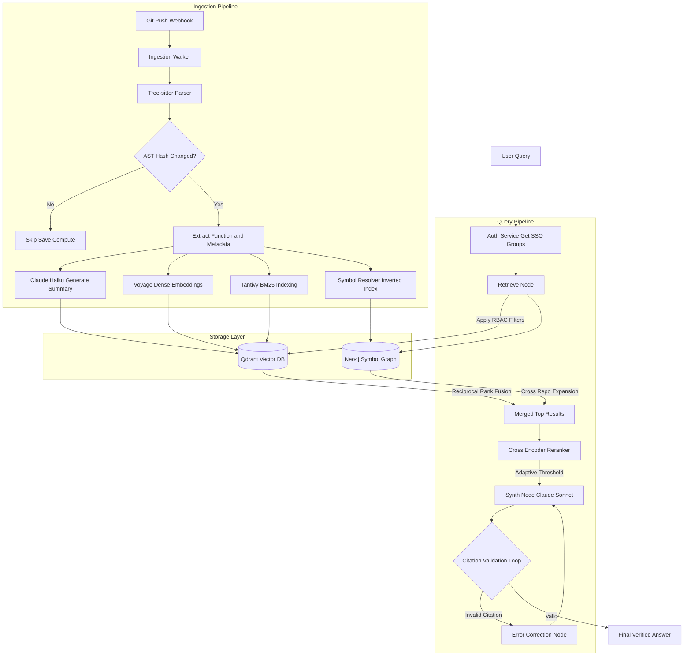

# Enterprise RAG for Teams

A production-grade, modular RAG system designed for internal departmental knowledge management and cross-repo code understanding.

## System Architecture

For a complete deep-dive text explanation of how these components work, see [architecture.md](./architecture.md).

## Getting Started

*(Instructions for setup will be added here as we build the components)*
