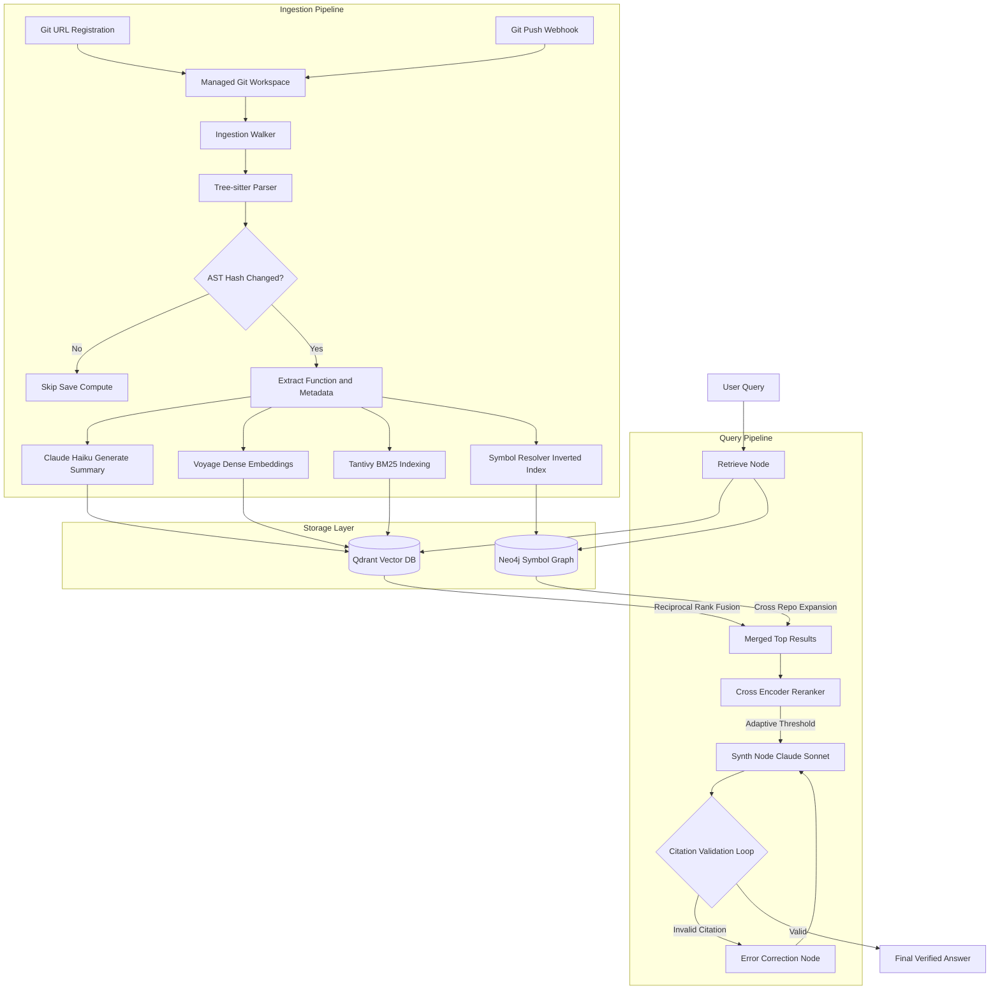

# Cross-Repo Code Search RAG

A learning-oriented, modular RAG system for cross-repo code understanding. Users register repositories by Git URL, the backend manages clone/fetch work internally, and the API provides ingestion plus cited code-search answers.

## System Architecture



For a complete deep-dive text explanation of how these components work, see [architecture.md](./architecture.md).

## Getting Started

Run the API locally:

```powershell
python -m uvicorn src.api.main:app --reload --host 127.0.0.1 --port 8000
```

Health check:

```powershell
Invoke-RestMethod http://127.0.0.1:8000/health
```

Run tests:

```powershell
python -m unittest discover -s tests
```

Start optional infrastructure:

```powershell
docker compose up -d qdrant neo4j
```

Use Qdrant for chunk vector persistence:

```powershell
$env:VECTOR_STORE="qdrant"
$env:QDRANT_URL="http://localhost:6333"
python -m uvicorn src.api.main:app --reload --host 127.0.0.1 --port 8000
```

If `VECTOR_STORE` is not set, the app uses in-memory storage so you can keep building without Docker.

Register a public Git repository:

```powershell
Invoke-RestMethod -Method Post http://127.0.0.1:8000/repositories `
  -ContentType "application/json" `
  -Body '{"name":"demo","git_url":"https://github.com/example/demo.git","default_branch":"main","visibility":"public"}'
```

Manual ingestion is permission-gated. First call with `confirm: false` to get the assistant permission event, then call with `confirm: true` when you want the backend to clone/fetch and index the repository.

Webhook ingestion uses the payload `before` and `after` commit SHAs to run `git diff --name-status`. Modified files are re-indexed, deleted files remove their old chunks, and renamed files clean up the previous path before indexing the new one.

Inspect the learned symbol graph for a repository:

```powershell
Invoke-RestMethod http://127.0.0.1:8000/repositories/<repo_id>/graph
```

Current build note: SSO, RBAC, authorization filtering, and production secret storage are intentionally deferred while the core ingestion and retrieval system is built.
