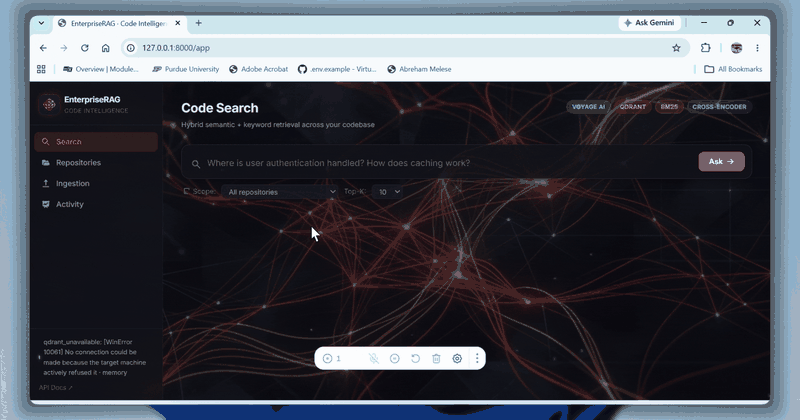
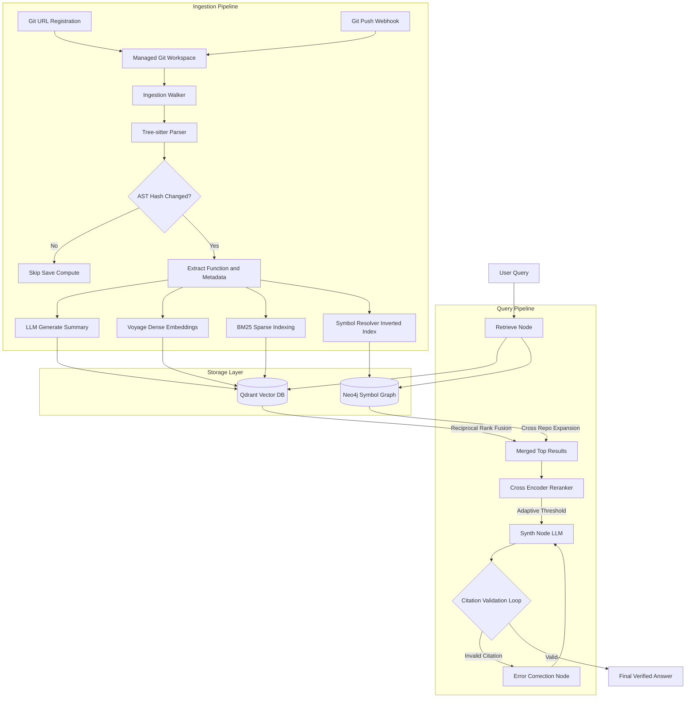

# EnterpriseRAG — Cross-Repository Code Intelligence

[](https://www.python.org/)
[](https://fastapi.tiangolo.com/)
[](https://langchain-ai.github.io/langgraph/)
[](#license)
[](https://voyage.ai/)
[](https://qdrant.tech/)
[](https://neo4j.com/)

> **Ask plain-English questions across many repositories. Get cited answers in seconds.**

<p align="center">
  
</p>

---

## What it does

EnterpriseRAG indexes **multiple Git repositories** into a single search surface, then answers natural-language questions about them with **inline citations and source links**. Built for engineering teams who need to onboard onto unfamiliar codebases fast — or for anyone tired of `grep` across half a dozen repos.

- **Register** any public Git repo by URL (or a local folder path).
- **Ingest** with one click — the backend clones, parses, extracts functions and classes via Tree-sitter, generates summaries, embeds with Voyage AI (`voyage-code-3`), and indexes with Qdrant + BM25 + Neo4j symbol graph.
- **Ask** in plain English. Get an answer with `[1]` `[2]` `[3]` citations linking directly to the relevant source file and line range on GitHub.

## Why it matters

| Pain point | How EnterpriseRAG solves it |
|---|---|
| New engineers spend weeks reading unfamiliar code | Ask "where is authentication handled?" and get the file + the function in seconds. |
| Cross-repo questions require hunting across N codebases | One query, many repos. Scoped to the repos you choose. |
| Most "AI code search" demos fail on real code | Hybrid retrieval (dense + sparse + graph expansion + cross-encoder reranking) with citation validation that fails closed. |
| Hardcoded scrapers don't scale | Register any Git URL. The backend handles clone/fetch, change detection, and incremental re-indexing from webhooks. |

## Architecture


```mermaid
graph TD
    U[User Query] --> Retrieve[Retrieve Node]

    subgraph "Ingestion Pipeline"
        direction TB
        Register[Git URL Registration] --> Workspace[Managed Git Workspace]
        Hook[Git Push Webhook] --> Workspace
        Workspace --> Walker[Ingestion Walker]
        Walker --> TS[Tree-sitter Parser]
        TS --> Hash{AST Hash Changed?}
        Hash -->|No| Skip[Skip Save Compute]
        Hash -->|Yes| Extract[Extract Function and Metadata]

        Extract --> Sum[LLM Generate Summary]
        Extract --> Embed[Voyage Dense Embeddings]
        Extract --> Sparse[BM25 Sparse Indexing]
        Extract --> Sym[Symbol Resolver Inverted Index]
    end

    subgraph "Storage Layer"
        direction TB
        Sum --> Qdrant[(Qdrant Vector DB)]
        Embed --> Qdrant
        Sparse --> Qdrant
        Sym --> Graph[(Neo4j Symbol Graph)]
    end

    subgraph "Query Pipeline"
        direction TB
        Retrieve --> Qdrant
        Qdrant -->|Reciprocal Rank Fusion| Merged[Merged Top Results]
        Retrieve --> Graph
        Graph -->|Cross Repo Expansion| Merged

        Merged --> Rerank[Cross Encoder Reranker]
        Rerank -->|Adaptive Threshold| Synth[Synth Node LLM]

        Synth --> Verify{Citation Validation Loop}
        Verify -->|Invalid Citation| Error[Error Correction Node]
        Error --> Synth
    end

    Verify -->|Valid| Output[Final Verified Answer]
```

For a complete deep-dive, see [architecture.md](./architecture.md).

## Tech stack

| Layer | Technology |
|---|---|
| API | FastAPI, Pydantic, Server-Sent Events |
| Orchestration | LangGraph (stateful retrieval graph) |
| Ingestion | Tree-sitter (Python AST parsing), Git CLI |
| Vector search | Qdrant (or in-memory fallback) |
| Sparse search | Custom BM25 |
| Graph | Neo4j (or in-memory inverted index) |
| Embeddings | Voyage AI `voyage-code-3` (1024-dim) |
| LLM synthesis | Groq (`openai/gpt-oss-120b`), Anthropic Claude, Google Gemini — pluggable |
| Frontend | Vanilla JS + a small, dark-themed UI served from `/app` |

## Quick start

### Run the API

```powershell
python -m venv .venv
.\.venv\Scripts\python.exe -m pip install -e .
python -m uvicorn src.api.main:app --reload --host 127.0.0.1 --port 8000
```

### Open the UI

```
http://127.0.0.1:8000/app
```

### Register your first repository

```powershell
Invoke-RestMethod -Method Post http://127.0.0.1:8000/repositories `
  -ContentType "application/json" `
  -Body '{"name":"fastapi","git_url":"https://github.com/fastapi/fastapi.git","default_branch":"master","visibility":"public"}'
```

If you only know the repo URL but not the default branch, leave `default_branch` as `main` — the backend will detect the correct branch automatically via the remote's `HEAD` symref.

### Confirm ingestion

```powershell
$repo = Invoke-RestMethod http://127.0.0.1:8000/repositories | Select-Object -First 1
Invoke-RestMethod -Method Post "http://127.0.0.1:8000/repositories/$($repo.id)/ingest" `
  -ContentType "application/json" -Body '{"confirm":true}'
```

### Ask a question

```powershell
Invoke-RestMethod -Method Post http://127.0.0.1:8000/query `
  -ContentType "application/json" `
  -Body '{"question":"Where is authentication handled?","top_k":5}'
```

You'll get a structured answer with `[N]`-style citations and clickable source links.

### Optional: bring the real infrastructure

```powershell
docker compose up -d qdrant neo4j
$env:VECTOR_STORE="qdrant"; $env:QDRANT_URL="http://localhost:6333"
$env:GRAPH_PROVIDER="neo4j"; $env:NEO4J_URI="bolt://localhost:7687"
python -m uvicorn src.api.main:app --reload
```

Without these, the app uses in-memory storage so you can keep building without Docker.

### Configuration (`.env`)

```env
VOYAGE_API_KEY=pa-...                  # voyage-code-3 embeddings
GROQ_API_KEY=gsk-...                   # default LLM (or ANTHROPIC_API_KEY / GOOGLE_API_KEY)
LLM_PROVIDER=groq
LLM_MODEL=openai/gpt-oss-120b
VOYAGE_MODEL=voyage-code-3
```

## API surface

| Method | Path | Purpose |
|---|---|---|
| `GET`  | `/health` | Liveness + backend status |
| `POST` | `/repositories` | Register a repo by Git URL (validates with `git ls-remote`; auto-detects default branch) |
| `GET`  | `/repositories` | List all registered repos |
| `GET`  | `/repositories/{id}` | Single repo + status, chunk count, last commit |
| `DELETE` | `/repositories/{id}` | Remove a repo |
| `POST` | `/repositories/{id}/ingest` | Permission-gated ingestion (`confirm: false` → review, `confirm: true` → run) |
| `GET`  | `/repositories/{id}/graph` | Symbol graph snapshot |
| `POST` | `/query` | Synchronous query |
| `POST` | `/query/stream` | SSE stream of pipeline steps + citations + answer |
| `POST` | `/webhooks/git` | Git push webhook for incremental re-indexing |

## Tests

```powershell
python -m unittest discover -s tests
```

## Design notes

- **Citation validation is fail-closed.** If the synthesizer cites a file or line that isn't in the retrieved set, the response is rejected and retried. This prevents hallucinations from leaking into answers.
- **Ingestion is incremental.** Tree-sitter AST hashes let us skip chunks that haven't changed since the last commit. Webhook payloads drive diff-based re-indexing.
- **Storage is pluggable.** Qdrant and Neo4j are swappable for in-memory implementations behind the same interfaces, so the system runs anywhere from a laptop to a cluster.

## Current scope and out-of-scope

SSO, RBAC, authorization filtering, and production secret storage are intentionally deferred while the core ingestion and retrieval pipeline is built. See [`prd.md`](./prd.md) and [`spec.md`](./spec.md) for the full product spec.

## License

MIT — see [`LICENSE`](./LICENSE).