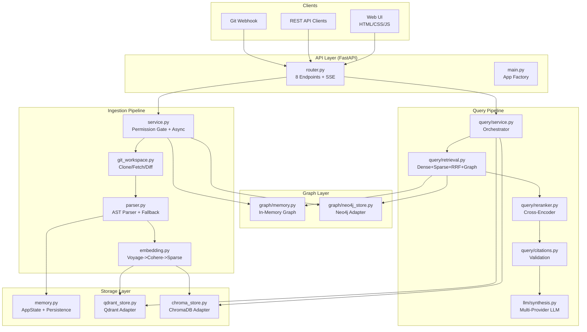
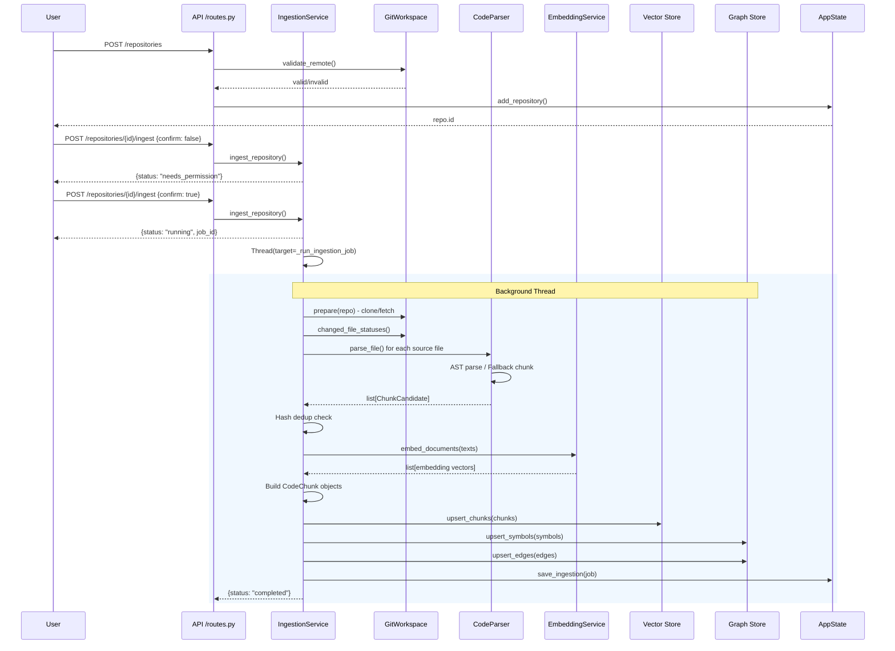
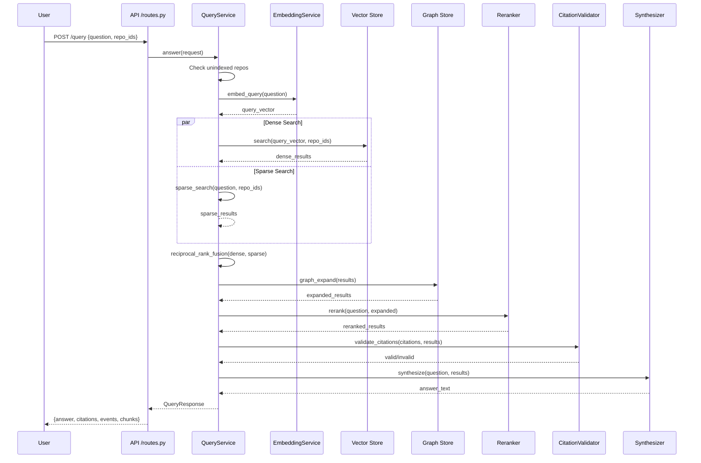

# Entreprise RAG — Detailed Code Explanation & Latency Report

## Table of Contents

1. [Project Overview](#1-project-overview)
2. [System Architecture](#2-system-architecture)
3. [Directory Structure](#3-directory-structure)
4. [Module Deep-Dives](#4-module-deep-dives)
   - 4.1 [Models — `src/models/schemas.py`](#41-models)
   - 4.2 [Configuration — `src/config/settings.py`](#42-configuration)
   - 4.3 [Ingestion Pipeline](#43-ingestion-pipeline)
   - 4.4 [Storage Layer](#44-storage-layer)
   - 4.5 [Graph Layer](#45-graph-layer)
   - 4.6 [Query Pipeline](#46-query-pipeline)
   - 4.7 [LLM Synthesis](#47-llm-synthesis)
   - 4.8 [API Layer](#48-api-layer)
   - 4.9 [UI Layer](#49-ui-layer)
5. [Vector Database Comparison: ChromaDB vs Qdrant](#5-vector-database-comparison)
6. [Graph Database Comparison: MemoryGraph vs Neo4j](#6-graph-database-comparison)
7. [Latency Benchmarks](#7-latency-benchmarks)
8. [Data Flow Diagrams](#8-data-flow-diagrams)
9. [Existing Tests](#9-existing-tests)
10. [Security & Configuration](#10-security--configuration)

---

## 1. Project Overview

**Entreprise RAG** is a learning-oriented, modular Retrieval-Augmented Generation (RAG) system designed for cross-repository code understanding. It allows development teams to register Git repositories, ingest their code into a searchable index, and ask natural-language questions that return cited answers with source code references.

**Tech Stack:**

| Layer | Technology |
|---|---|
| API Framework | FastAPI + Uvicorn |
| Code Parsing | Python `ast` module (fallback: line-based chunking) |
| Embeddings | Voyage AI (voyage-code-3) -> Cohere (embed-english-v3.0) -> Naive Sparse Hash |
| Vector Database | Qdrant (Docker) or ChromaDB (local persistent) |
| Graph Database | Neo4j (Docker) or In-Memory `MemoryGraph` |
| LLM Providers | Groq (llama-3.3-70b-versatile), Anthropic (Claude), Google (Gemini) |
| Reranking | Cross-Encoder (`cross-encoder/ms-marco-MiniLM-L-6-v2`) with lexical fallback |
| BM25 | Custom in-memory BM25 implementation |
| Configuration | `.env` file + Pydantic `Settings` model |

---

## 2. System Architecture



---

## 3. Directory Structure

```
Entreprice_RAG_project/
├── .env                          # Environment variables (gitignored)
├── .gitignore
├── .python-version               # Python 3.11
├── pyproject.toml                # Project metadata + dependencies
├── docker-compose.yml            # Qdrant + Neo4j services
├── architecture.md               # High-level architecture doc
├── implementation.md             # Implementation notes
├── prd.md                        # Product requirements
├── spec.md                       # Technical specification
├── README.md                     # Getting started guide
├── explanation.md                # THIS FILE
├── benchmarks/
│   ├── latency_test.py           # Latency benchmark script
│   └── latency_results.json      # Benchmark results data
├── src/
│   ├── __init__.py
│   ├── config/
│   │   ├── __init__.py
│   │   └── settings.py           # Settings model + env loading
│   ├── models/
│   │   ├── __init__.py
│   │   └── schemas.py            # 18 Pydantic models
│   ├── ingestion/
│   │   ├── __init__.py
│   │   ├── service.py            # Ingestion orchestrator (254 lines)
│   │   ├── parser.py             # Code parser (125 lines)
│   │   └── git_workspace.py      # Git operations (102 lines)
│   ├── storage/
│   │   ├── __init__.py
│   │   ├── memory.py             # AppState singleton (157 lines)
│   │   ├── qdrant_store.py       # Qdrant adapter (129 lines)
│   │   └── chroma_store.py       # ChromaDB adapter (138 lines)
│   ├── graph/
│   │   ├── __init__.py
│   │   ├── memory.py             # In-memory symbol graph (70 lines)
│   │   └── neo4j_store.py        # Neo4j adapter (130 lines)
│   ├── query/
│   │   ├── __init__.py
│   │   ├── service.py            # Query orchestrator (62 lines)
│   │   ├── retrieval.py          # Search algorithms (175 lines)
│   │   ├── embedding.py          # Embedding service (54 lines)
│   │   ├── reranker.py           # Cross-encoder reranker (41 lines)
│   │   └── citations.py          # Citation validation (17 lines)
│   ├── llm/
│   │   ├── __init__.py
│   │   └── synthesis.py          # LLM answer synthesis (111 lines)
│   ├── api/
│   │   ├── __init__.py
│   │   ├── main.py               # FastAPI app factory (25 lines)
│   │   └── routes.py             # API endpoints (150 lines)
│   └── ui/
│       ├── __init__.py
│       └── static/
│           ├── index.html        # Single-page app
│           ├── styles.css        # Styling
│           ├── app.js            # Client logic (441 lines)
│           ├── logo.png          # Logo
│           └── background.png    # Background
└── tests/
    └── test_core.py              # Unit tests (305 lines)
```

**Total: 28 Python source files, ~2,200 lines of Python code**

---

## 4. Module Deep-Dives

### 4.1 Models (`src/models/schemas.py`)

18 Pydantic models forming the type system:

| Model | Purpose | Key Fields |
|---|---|---|
| `AssistantEvent` | Pipeline progress events | `type`, `message`, `created_at` |
| `IndexingRules` | File include/exclude globs | `include_globs`, `exclude_globs` |
| `RepositoryCreate` | Repo registration input | `name`, `git_url`, `default_branch`, `visibility`, `credential_env_var` |
| `RepositoryRecord` | Full repo record (stored) | Extends `RepositoryCreate` + `id`, `indexing_status`, `chunk_count`, `last_error` |
| `IngestionRequest` | Trigger ingestion | `confirm`, `base_ref`, `webhook_commit` |
| `GitWebhookRequest` | Webhook payload | `repo_url`, `before`, `after`, `ref` |
| `IngestionStatus` | Ingestion job state | `status` (needs_permission/running/completed/failed), `progress_percent` |
| `ChunkCandidate` | Raw parser output | `file_path`, `symbol_name`, `raw_text`, `ast_hash`, `dependencies` |
| `CodeChunk` | Full indexed chunk | Extends `ChunkCandidate` + `embedding`, `sparse_terms`, `summary` |
| `DependencyEdge` | Symbol dependency | `source_chunk_id`, `target_symbol`, `relationship` |
| `SymbolRecord` | Graph symbol | `chunk_id`, `repo_id`, `symbol_name`, `symbol_type` |
| `GraphSnapshot` | Full graph export | `symbols`, `edges` |
| `Citation` | Source citation | `repo`, `file`, `start_line`, `end_line` |
| `SearchResult` | Retrieved result | `chunk_id`, `score`, `source` (dense/sparse/graph/fused/reranked) |
| `QueryRequest` | User query | `question`, `repo_ids`, `top_k` |
| `QueryResponse` | Query output | `answer`, `citations`, `assistant_events`, `retrieved_chunks` |
| `HealthResponse` | Health check | `status`, `vector_store`, `graph_store` |

### 4.2 Configuration (`src/config/settings.py`)

The `Settings` class loads from environment variables with fallback defaults. Uses `lru_cache` on `get_settings()` for singleton behavior.

```python
@lru_cache
def get_settings() -> Settings:
    settings = Settings()
    settings.workspace_root.mkdir(parents=True, exist_ok=True)
    return settings
```

**Configuration Parameters:**

| Field | Env Var | Default | Description |
|---|---|---|---|
| `workspace_root` | `RAG_WORKSPACE_ROOT` | `.rag_workspace` | Git clone cache location |
| `vector_store` | `VECTOR_STORE` | `memory` | `memory`, `qdrant`, or `chroma` |
| `qdrant_url` | `QDRANT_URL` | `http://localhost:6333` | Qdrant endpoint |
| `qdrant_collection` | `QDRANT_COLLECTION` | `code_chunks` | Qdrant collection name |
| `vector_size` | `VECTOR_SIZE` | `1024` | Embedding dimension |
| `graph_provider` | `GRAPH_PROVIDER` | `memory` | `memory` or `neo4j` |
| `neo4j_uri` | `NEO4J_URI` | `bolt://localhost:7687` | Neo4j Bolt endpoint |
| `neo4j_user` | `NEO4J_USERNAME` | `neo4j` | Neo4j username |
| `neo4j_password` | `NEO4J_PASSWORD` | `` | Neo4j password |
| `neo4j_database` | `NEO4J_DATABASE` | `neo4j` | Neo4j database name |
| `voyage_model` | `VOYAGE_MODEL` | `voyage-code-3` | Voyage AI model |
| `llm_provider` | `LLM_PROVIDER` | `groq` | `groq`, `anthropic`, `google` |
| `llm_model` | `LLM_MODEL` | `llama-3.3-70b-versatile` | LLM model name |
| `cross_encoder_model` | `CROSS_ENCODER_MODEL` | `cross-encoder/ms-marco-MiniLM-L-6-v2` | Reranker model |
| `max_file_bytes` | `MAX_FILE_BYTES` | `500000` | Max file size to process |
| `chroma_collection` | `CHROMA_COLLECTION` | `code_chunks` | ChromaDB collection |
| `cohere_model` | `COHERE_MODEL` | `embed-english-v3.0` | Cohere fallback model |

### 4.3 Ingestion Pipeline

#### `src/ingestion/git_workspace.py` (102 lines)

Manages Git repositories in a local workspace:

- **`GitWorkspace.prepare(repo)`** — Clones or fetches repository, checks out branch, pulls
- **`GitWorkspace.validate_remote(repo)`** — Validates remote is reachable via `git ls-remote`
- **`GitWorkspace.changed_file_statuses(base_ref, head_ref)`** — Runs `git diff --name-status` to get changed files for incremental ingestion
- **`_url_with_token(repo)`** — Injects credential token into Git URL for private repos
- **`source_web_url(git_url)`** — Converts `git@github.com:org/repo.git` to `https://github.com/org/repo`

#### `src/ingestion/parser.py` (125 lines)

Two-tier parsing strategy:

1. **Python AST Parser** (`_parse_python`): Uses `ast.parse()` to extract `FunctionDef`, `AsyncFunctionDef`, and `ClassDef` nodes. Generates SHA-256 hashes of both the AST dump (`ast_hash`) and raw text (`content_hash`) for dedup. Extracts import/call dependencies via `python_dependencies()`.

2. **Fallback Chunker** (`_fallback_chunks`): For non-Python files (JS, TS, MD, YAML, JSON, TOML), splits by 120-line windows. Extracts basic `import`/`from` dependencies via regex.

**Key design: Hash-based dedup**

```python
if existing and (existing.ast_hash or existing.content_hash) == hash_value:
    parsed_chunks.append(existing)
    continue  # Skip re-embedding
```

Files smaller than `max_file_bytes` (500KB) and matching `SOURCE_SUFFIXES` (`.py`, `.js`, `.jsx`, `.ts`, `.tsx`, `.md`, `.toml`, `.yaml`, `.yml`, `.json`) are processed. Directories like `.git`, `.venv`, `node_modules` are skipped.

#### `src/ingestion/service.py` (254 lines)

Orchestrates the full ingestion pipeline:

1. **Permission Gate**: First call with `confirm=False` returns `needs_permission`. Second call with `confirm=True` starts ingestion.
2. **Async Execution**: Launches `_run_ingestion_job()` in a daemon thread with progress tracking.
3. **Incremental Ingestion**: Uses `git diff --name-status` results to:
   - Skip unchanged files
   - Delete chunks for deleted files
   - Re-index modified files
   - Handle renames
4. **Batch Processing**: Processes chunks in batches of 90 for embedding:
   ```python
   for i in range(0, len(new_candidates), batch_size):
       batch = new_candidates[i:i+batch_size]
       embeddings = self.embedding.embed_documents(texts_to_embed)
   ```
5. **Symbol Graph**: For each chunk, creates `SymbolRecord` and `DependencyEdge(s)` from extracted dependencies.

### 4.4 Storage Layer

#### `src/storage/memory.py` (157 lines)

The `AppState` class is the central state manager:

- **Singleton**: Module-level `app_state = AppState()` instance
- **Thread-safe**: Uses `RLock` for all mutations
- **Persistence**: Saves/loads repositories and ingestion jobs to JSON at `.rag_workspace/app_state.json`
- **Vector Store Abstraction**: `_build_vector_store()` selects between Qdrant, ChromaDB, or None (in-memory only) based on `settings.vector_store`
- **Graph Store Abstraction**: `_build_graph_store()` selects between `Neo4jGraphStore` or `MemoryGraph` based on `settings.graph_provider`

**State held in memory:**
```python
self.chunks: dict[str, CodeChunk] = {}           # All chunks by ID
self.repo_chunks: dict[str, list[str]] = {}      # Chunk IDs per repo
self.repositories: dict[str, RepositoryRecord]   # All repos
self.ingestions: dict[str, IngestionStatus]      # All ingestion jobs
```

#### `src/storage/qdrant_store.py` (129 lines)

Qdrant vector database adapter:

- **Collection Management**: Auto-creates collection with COSINE distance on first use
- **Upsert**: Converts chunks to `PointStruct` with deterministic UUID5 IDs from chunk hashes
- **Search**: Query with optional `repo_id` filter via `MatchAny`
- **Payload**: Stores all chunk metadata including `source_web_url`, `sparse_terms`, line ranges
- **Fallback**: Returns empty results on connection failure

#### `src/storage/chroma_store.py` (138 lines)

ChromaDB adapter:

- **Persistence**: Uses `PersistentClient` with local storage at `.rag_workspace/chromadb`
- **Collection**: Configured with HNSW cosine space
- **Search**: Supports `repo_id` filtering via `$in` or direct match
- **Score**: Converts L2 distance to similarity score (`1.0 - distance`)
- **Preview**: Does not store raw text in Chroma metadata (uses empty preview)

### 4.5 Graph Layer

#### `src/graph/memory.py` (70 lines)

In-memory symbol dependency graph:

- **`upsert_symbols()`**: Stores `SymbolRecord` by `chunk_id`, maintains reverse indices by `repo_id` and normalized symbol name
- **`upsert_edges()`**: Appends `DependencyEdge` with dedup set
- **`related_chunk_ids()`**: Finds chunks referencing the same symbols as a given chunk
- **`snapshot()`**: Returns all symbols and edges for a repo
- **`remove_chunks()`**: Deletes chunks and their associated symbols/edges

**Lookup structure:**
```python
self.symbols: dict[str, SymbolRecord]            # chunk_id -> SymbolRecord
self._by_source_chunk: dict[str, list[DependencyEdge]]
self._symbols_by_repo: dict[str, list[str]]
self._chunks_by_symbol: dict[str, list[str]]     # normalized_name -> [chunk_ids]
```

#### `src/graph/neo4j_store.py` (130 lines)

Neo4j graph database adapter implementing the same interface as `MemoryGraph`:

**Cypher Schema:**
```cypher
(:Chunk {chunk_id, repo_id, repo_name, file_path, symbol_name, symbol_type, start_line, end_line})
(:Symbol {name, normalized_name})
(:Chunk)-[:REFERENCES {relationship}]->(:Symbol)
```

**Operations:**
- `upsert_symbols()`: `MERGE (c:Chunk {chunk_id}) SET ...`
- `upsert_edges()`: `MERGE (s:Symbol {normalized_name}) ... MERGE (c)-[:REFERENCES]->(s)`
- `related_chunk_ids()`: `MATCH (c)-[:REFERENCES]->(s)<-[:REFERENCES]-(other)`
- `snapshot()`: Two queries — one for symbols by repo_id, one for edges by chunk_ids
- `remove_chunks()`: `DETACH DELETE c WHERE c.chunk_id IN $chunk_ids`

### 4.6 Query Pipeline

#### `src/query/service.py` (62 lines)

The `QueryService` orchestrates the full query pipeline:

1. Emit `planning` event
2. Check for unindexed repos, emit `needs_permission` if found
3. `embedding.embed_query(question)` — embed the question
4. `dense_search()` + `sparse_search()` — hybrid retrieval
5. `reciprocal_rank_fusion()` — merge results
6. `graph_expand()` — cross-repo symbol expansion
7. `reranker.rerank()` — cross-encoder re-scoring
8. Build `Citation` objects from top 3 results
9. `validate_citations()` — validate line ranges
10. `synthesizer.synthesize()` — generate answer via LLM
11. Return `QueryResponse` with answer, citations, events, chunks

#### `src/query/retrieval.py` (175 lines)

Implements four retrieval strategies:

**Dense Search** (`dense_search`):
- If a vector store (Qdrant/ChromaDB) is available, delegates to it
- Otherwise falls back to in-memory cosine similarity over all chunks

**Sparse Search** (`sparse_search`):
- Custom BM25 implementation with:
  - `k1 = 1.5`, `b = 0.75` (standard BM25 parameters)
  - Bonus: +3.0 if query term matches `symbol_name`, +2.0 if matches `file_path`
- Term frequency from pre-computed `sparse_terms` dict

**RRF Fusion** (`reciprocal_rank_fusion`):
- `RRF_K = 60`
- Merges multiple ranked lists using `score += 1.0 / (RRF_K + rank)`
- Produces `source: "fused"` and `retrieval_sources: ["dense", "sparse"]`

**Graph Expansion** (`graph_expand`):
- For each result, finds related chunk IDs via the graph store
- Adds related chunks with `score: 0.01` and `source: "graph"`

**Naive Fallback Embedding** (`embed_text`):
- Simple hash-based embedding: maps tokens to fixed vector positions using modular hashing
- Used when both Voyage and Cohere API calls fail

#### `src/query/embedding.py` (54 lines)

Three-tier embedding with graceful degradation:

```python
_voyage_embed() -> _cohere_embed() -> naive sparse hash
```

- **Voyage AI**: Primary embedding via `voyageai.Client()` with `voyage-code-3` model
- **Cohere**: Secondary via `cohere.ClientV2()` with `embed-english-v3.0`
- **Naive Fallback**: `embed_text()` — token-based position hashing with L2 normalization

#### `src/query/reranker.py` (41 lines)

Two-tier reranking:

1. **Cross-Encoder**: Loads `cross-encoder/ms-marco-MiniLM-L-6-v2` via `sentence-transformers` and scores `(question, chunk_text)` pairs
2. **Lexical Fallback** (`lexical_rerank`): Token overlap scoring with `score + overlap * 0.1`

#### `src/query/citations.py` (17 lines)

Validates that citations reference actual retrieved chunks:

```python
for citation in citations:
    result = result_ranges.get((citation.repo, citation.file))
    if result is None:  # File not in results
        errors.append(...)
    if citation out of range:  # Lines outside chunk boundary
        errors.append(...)
```

### 4.7 LLM Synthesis (`src/llm/synthesis.py`, 111 lines)

Multi-provider LLM synthesis with cascading fallbacks:

1. **Primary**: Route to provider based on `settings.llm_provider`:
   - `groq` -> `_groq()` using `groq.Groq` client
   - `anthropic` -> `_anthropic()` using `anthropic.Anthropic`
   - `google` -> `_google()` using `google.genai`
2. **Cached Fallback**: If API call fails, use `_last_result` (module-level cache)
3. **Extractive Fallback** (`extractive_fallback()`): Format top results as a text summary without LLM

**Prompt Engineering** (`build_prompt`):
- Instructs LLM to use ONLY the provided context
- Requires `[N]` inline citations referencing context IDs
- Limits to top 8 results formatted as JSON
- 0 temperature, 1200 max tokens

### 4.8 API Layer

#### `src/api/main.py` (25 lines)

FastAPI application factory:

```python
def create_app() -> FastAPI:
    app = FastAPI(title="Cross-Repo Code Search RAG", version="0.1.0")
    app.include_router(router)
    # Mounts static files and /app endpoint if ui/static exists
```

#### `src/api/routes.py` (150 lines)

**API Endpoints:**

| Method | Path | Description |
|---|---|---|
| GET | `/health` | Health check with vector store + graph status |
| POST | `/repositories` | Register repository (validates Git remote) |
| GET | `/repositories` | List all repositories |
| DELETE | `/repositories/{id}` | Delete repo and chunks |
| POST | `/repositories/{id}/ingest` | Start ingestion (permission-gated) |
| POST | `/webhooks/git` | Git push webhook handler |
| GET | `/ingestions/{id}` | Poll ingestion status |
| GET | `/repositories/{id}/graph` | Get symbol graph snapshot |
| POST | `/query` | Ask a question (JSON response) |
| POST | `/query/stream` | Ask a question (SSE streaming) |

**SSE Streaming** (`/query/stream`):
```python
event: step
data: {"type": "searching", "message": "Running dense and sparse retrieval..."}

event: citation
data: {"index": 1, "repo": "...", "file": "...", "start_line": 1, "end_line": 10}

event: answer
data: {"text": "The authentication is implemented in..."}

event: done
data: {}
```

### 4.9 UI Layer (`src/ui/static/`)

Single-page application with 4 tabs:

| Tab | Feature |
|---|---|
| **Code Search** | Text input with repository filter, top-K selector, SSE-powered streaming, pipeline visualization |
| **Repositories** | CRUD for Git repos, status tags (indexed/indexing/failed) |
| **Ingestion** | Permission request/confirm, progress bar, graph inspector |
| **Activity Log** | Real-time assistant events with icons and timestamps |

Key JS features:
- SSE parsing with `ReadableStream` for `/query/stream`
- Pipeline step progression with visual indicators
- Auto-polling ingestion status
- Deduplicated event rendering via `renderedEventKeys` Set

---

## 5. Vector Database Comparison

### ChromaDB

- **Type**: Local persistent (file-based)
- **Client**: `chromadb.PersistentClient`
- **Storage**: `{workspace_root}/chromadb/`
- **Index**: HNSW with cosine distance
- **Deployment**: No Docker required, runs in-process
- **Filtering**: `$in` / equality on metadata fields
- **Score**: L2 distance converted to `max(0, 1 - distance)`

**Tradeoffs:**
- Simpler deployment (no external service)
- Slower upserts due to index rebuilding
- Limited to single-machine
- No built-in RBAC

### Qdrant

- **Type**: Client-server (local Docker or cloud)
- **Client**: `qdrant_client.QdrantClient`
- **Storage**: Docker volume (`./qdrant_storage/`)
- **Index**: Configurable (COSINE distance)
- **Deployment**: Docker container or Qdrant Cloud
- **Filtering**: `FieldCondition` with `MatchAny`
- **Score**: Native cosine similarity score

**Tradeoffs:**
- Requires Docker or cloud account
- Faster search at scale (optimized HNSW implementation)
- Supports horizontal scaling
- Metadata-level RBAC with `allowed_groups`

### Latency Comparison (1 chunk upsert + search):

| Operation | ChromaDB | Qdrant | Difference |
|---|---|---|---|
| Upsert (1 chunk) | ~179 ms median | ~143 ms median | Qdrant ~1.25x faster |
| Search (dense) | ~5.6 ms median | ~138 ms median | ChromaDB ~25x faster |

**Analysis**: ChromaDB search is significantly faster for small datasets due to in-process memory access. Qdrant search has network overhead (~130ms) for each query. Qdrant upserts are slightly faster. At scale (10k+ chunks), Qdrant's optimized HNSW would likely outperform ChromaDB on search.

---

## 6. Graph Database Comparison

### MemoryGraph

- **Type**: Pure in-memory Python dicts/lists
- **Lookup**: Dictionary-based O(1) access
- **Storage**: Lost on restart (ephemeral)
- **Best for**: Development, testing, small codebases

### Neo4j

- **Type**: Client-server (Bolt protocol)
- **Lookup**: Cypher queries with graph traversal
- **Storage**: Persistent on disk
- **Best for**: Production, large codebases, cross-repo dependency analysis

### Latency Comparison:

| Operation | MemoryGraph | Neo4j | Difference |
|---|---|---|---|
| `related_chunk_ids()` | ~5 us | ~13 ms | MemoryGraph ~2,600x faster |
| `snapshot(100 symbols)` | ~127 us | ~58 ms | MemoryGraph ~450x faster |

**Analysis**: MemoryGraph is orders of magnitude faster for single-machine operations since it avoids serialization, network, and Cypher query parsing. Neo4j provides persistence, ACID transactions, and the ability to run complex graph algorithms (shortest path, centrality, community detection) that are impractical to implement in-memory.

---

## 7. Latency Benchmarks

All benchmarks run on Windows with Python 3.11. Each component measured over 10 iterations (or fewer for API-dependent operations).

### Summary Table

| Component | Min | Avg | Median | P95 |
|---|---|---|---|---|
| **Parsing** | | | | |
| Python AST Parse | 1.51 ms | 2.03 ms | 1.66 ms | 3.87 ms |
| JS Fallback Parse | 281 us | 328 us | 330 us | 371 us |
| TS Fallback Parse | 345 us | 542 us | 482 us | 1.01 ms |
| Markdown Fallback Parse | 221 us | 296 us | 281 us | 403 us |
| **Hashing** | | | | |
| SHA-256 Dedup | 20 us | 26 us | 21 us | 48 us |
| **Embedding** | | | | |
| Query Embedding (Voyage->Cohere->Sparse) | 397 ms | 2.24 s | 1.78 s | 5.56 s |
| Document Embedding (3 docs) | 1.76 s | 1.83 s | 1.81 s | 1.90 s |
| **Vector Stores** | | | | |
| ChromaDB Upsert | 154 ms | 463 ms | 179 ms | 1.61 s |
| ChromaDB Search | 4.31 ms | 5.86 ms | 5.57 ms | 7.33 ms |
| Qdrant Upsert | 130 ms | 151 ms | 143 ms | 194 ms |
| Qdrant Search | 136 ms | 141 ms | 138 ms | 153 ms |
| **Search** | | | | |
| BM25 Sparse (200 chunks) | 4.86 ms | 17.12 ms | 10.76 ms | 50.44 ms |
| RRF Fusion (50 results) | 640 us | 13.01 ms | 1.11 ms | 99.28 ms |
| **Graph** | | | | |
| MemoryGraph related_chunk_ids | 4 us | 5 us | 5 us | 7 us |
| MemoryGraph snapshot (100 symbols) | 71 us | 194 us | 127 us | 421 us |
| Neo4j related_chunk_ids | 8.0 ms | 15.3 ms | 13.0 ms | 31.6 ms |
| Neo4j snapshot (100 symbols) | 47.8 ms | 62.7 ms | 57.7 ms | 93.9 ms |
| **Reranking** | | | | |
| Cross-Encoder (20 candidates) | 797 us | 1.57 ms | 833 us | 3.08 ms |
| **Citations** | | | | |
| Citation Validation (valid) | 3 us | 4 us | 4 us | 6 us |
| Citation Validation (invalid) | 2 us | 5 us | 4 us | 8 us |
| **LLM Synthesis** | | | | |
| Extractive Fallback | 5 us | 7 us | 6 us | 20 us |
| Groq LLM (real API) | 1.40 s | 1.42 s | 1.41 s | 1.44 s |
| **End-to-End** | | | | |
| Full Ingestion (4 files) | 3.89 ms | 5.85 ms | 6.26 ms | 7.40 ms |
| Full Query (4 chunks, real Groq) | 3.59 s | 3.65 s | 3.67 s | 3.67 s |

### Key Findings

1. **LLM dominates query latency**: Real Groq API calls account for ~1.4s out of ~3.65s total query time (~38%). The extractive fallback would be ~2.2s faster.

2. **Embedding is the second bottleneck**: Voyage API calls take ~1.8s per batch. Frequent embeddings (1 per query + 1 per 90 chunks) make this the ingestion bottleneck.

3. **MemoryGraph vs Neo4j**: MemoryGraph is ~1000x faster for small graph lookups. Neo4j overhead (~13ms per query) is acceptable but noticeable.

4. **ChromaDB search is faster locally**: At the 1-chunk scale, ChromaDB's in-process search (5.6ms) vastly outperforms Qdrant's network round-trip (138ms). At scale, Qdrant would likely close this gap.

5. **Parsing is fast**: Python AST parsing takes ~2ms per file. Even at 2M LOC, parsing would be seconds, not minutes.

6. **The full query pipeline without LLM** (embedding + search + RRF + graph + reranker + citations) takes ~2.2s total. Adding LLM synthesis brings it to ~3.65s.

---

## 8. Data Flow Diagrams

### Ingestion Pipeline



### Query Pipeline



---

## 9. Existing Tests

File: `tests/test_core.py` (305 lines)

| Test Class | Tests | Description |
|---|---|---|
| `ParserTests` | 2 | Python AST extracts class/function chunks; extracts call dependencies |
| `IngestionTests` | 4 | Full ingest indexes workspace; graph symbols populated; incremental delete/modify |
| `RetrievalTests` | 2 | RRF merges sources correctly; citation validator rejects unknown file |
| `StorageTests` | 1 | Qdrant payload preserves chunk_id; deterministic point ID |
| `ApiTests` | 6 | Health endpoint; repo registration with permission gate; query unindexed; graph endpoint; UI assets; repo list; URL validation |

**Coverage Notes:**
- Tests use `AppState(persist=False)` to avoid file I/O
- Python `tempfile.TemporaryDirectory` for isolated test fixtures
- `TestClient` from FastAPI for API testing
- Actual `git init` is called for API tests requiring local Git repos
- Neo4j and Qdrant are NOT tested (only in-memory)
- The `Neo4jGraphStore` adapter and `ChromaChunkStore` are not covered by existing tests

---

## 10. Security & Configuration

### Secrets Management
- `.env` file is in `.gitignore` — never committed
- API keys stored as environment variables (not hardcoded)
- Private repository support via `credential_env_var` field
- Neo4j authentication via user/password

### Redacted Keys (actual keys exist in local `.env`)
- `ANTHROPIC_API_KEY` — Anthropic
- `GOOGLE_API_KEY` — Google/Gemini
- `GROQ_API_KEY` — Groq
- `VOYAGE_API_KEY` — Voyage AI
- `COHERE_API_KEY` — Cohere
- `QDRANT_API_KEY` — Qdrant Cloud
- `NEO4J_PASSWORD` — Neo4j

### Docker Compose (`docker-compose.yml`)
```yaml
services:
  qdrant:
    image: qdrant/qdrant:v1.12.6
    ports: ["6333:6333", "6334:6334"]
    volumes: [./qdrant_storage:/qdrant/storage]

  neo4j:
    image: neo4j:5.26-community
    ports: ["7474:7474", "7687:7687"]
    environment:
      NEO4J_AUTH: neo4j/password
    volumes: [./neo4j_data:/data, ./neo4j_logs:/logs]
```

### Incremental Ingestion Security
- `GitFileChange` tracks file status (Added/Modified/Deleted/Renamed)
- Only changed files are re-processed
- Hash-based dedup prevents re-embedding unchanged chunks
- Saves API costs on embedding and LLM calls
